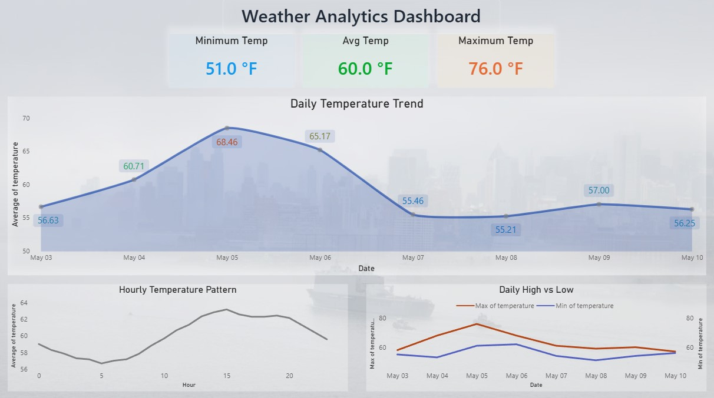

# 🌦️ Weather Analytics Platform (Microsoft Fabric)

## 📌 Overview

This project demonstrates an end-to-end data pipeline built using Microsoft Fabric. It ingests weather data from an external API, processes it through a Lakehouse and Warehouse, and visualizes insights using Power BI with DirectLake.

## 📸 Dashboard Preview

---

## 🧱 Architecture

*(Diagram coming soon)*

---

## 🔄 Data Pipeline Flow

* API → Python Notebook → Lakehouse
* Dataflow Gen2 → Data Transformation
* Warehouse → Structured Storage
* DirectLake → Semantic Model
* Power BI → Visualization

---

## 📊 Dashboard Features

* Daily temperature trends
* Hourly temperature analysis
* Min / Avg / Max KPIs

---

## 🛠️ Tech Stack

* Microsoft Fabric
* Python
* SQL
* Power BI

---

## 🚀 Status

🚧 Work in Progress – Documentation and assets being added

